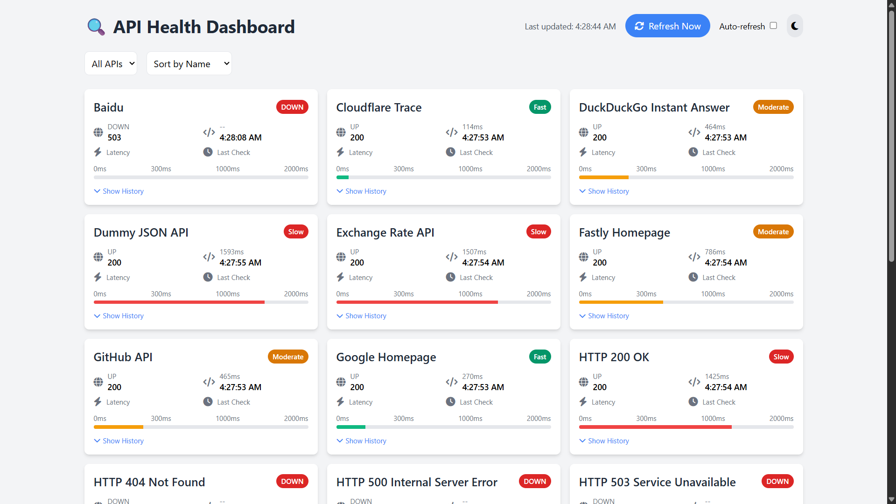
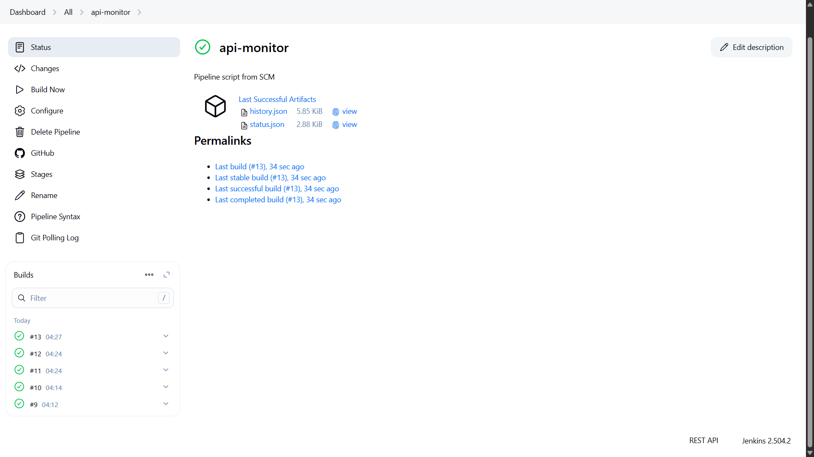
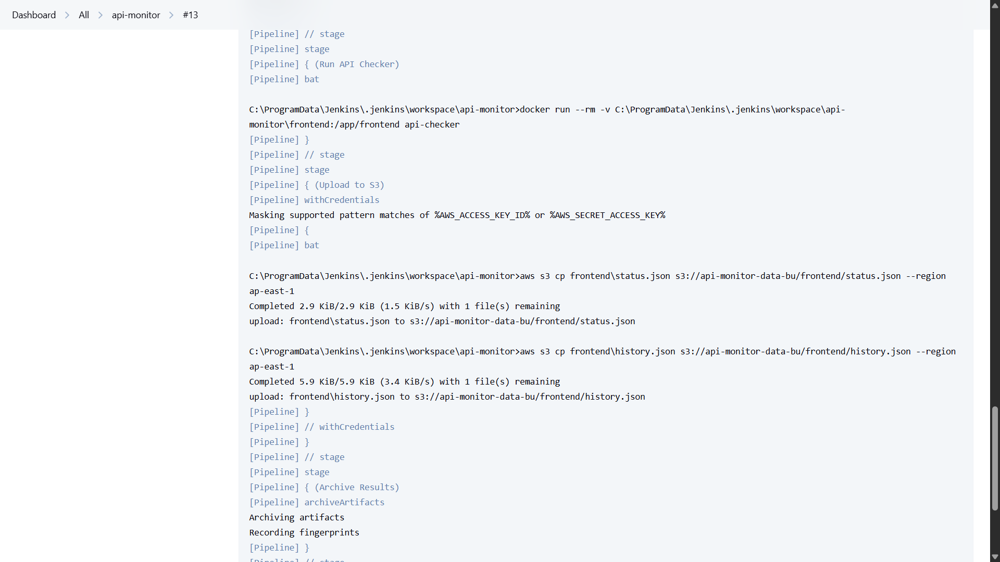

# 📡 API Health Monitoring Dashboard
[](https://apimonitor.netlify.app/)  

A **DevOps-friendly** monitoring dashboard to track the health, status, and latency of public APIs. Built with **Node.js**, **Docker**, **Jenkins**, **AWS S3**, and a beautiful **frontend (HTML + Tailwind)**, this app runs periodic health checks and displays real-time status reports in a responsive UI.

## 🧠 Features

- ✅ Monitor multiple public or private APIs.
- 📊 Visual latency bars, HTTP codes, and recent history.
- ⚠️ Highlights **critical** services that go down.
- ♻️ Auto-refresh & manual refresh options.
- 🌙 Dark mode toggle.
- 📂 Stores results in AWS S3 (`status.json`, `history.json`).
- 🚀 Frontend deployable via Netlify or any static host.
- 🧪 Configurable API list (`apis.json`) with flexible endpoint formats.

## 🧱 Architecture

```
          ┌────────────┐
          │  apis.json │◄── List of APIs to monitor
          └────┬───────┘
               │
        ┌──────▼───────┐
        │ Node.js App  │ ◄── Checks status, latency, code
        │ (checker.js) │
        └─────┬────────┘
              │
       ┌──────▼──────┐
       │ Dockerized  │ ◄── Jenkins builds and runs this container
       └──────┬──────┘
              │
    ┌─────────▼─────────┐
    │ Jenkins CI/CD     │ ◄── Runs every 30 minutes via cron
    │ - Executes checker│
    │ - Uploads JSONs   │
    └─────────┬─────────┘
              │
     ┌────────▼─────────┐
     │ AWS S3 Bucket    │ ◄── Stores status.json, history.json
     └────────┬─────────┘
              │
       ┌──────▼───────┐
       │ Frontend App │ ◄── Fetches JSONs, renders dashboard
       └──────────────┘
```

## 🧰 Tech Stack

| Layer       | Tool                            |
|-------------|---------------------------------|
| Backend     | Node.js + Axios                 |
| DevOps      | Jenkins, Docker, AWS S3         |
| Frontend    | HTML + Tailwind + JS (Vanilla)  |
| Deployment  | Netlify (Frontend), AWS S3 (Data) |
| JSON Store  | `status.json`, `history.json`   |

## 📦 Directory Structure

```bash
api-monitor/
├── checker/
│   └── checker.js
├── frontend/
│   └── index.html
├── apis.json
├── Dockerfile
├── Jenkinsfile
└── README.md
```

## 🛠️ Setup Instructions

### 1. Clone Repository

```bash
git clone https://github.com/your-username/api-monitor.git
cd api-monitor
```

### 2. Configure `apis.json`

```json
[
  {
    "name": "GitHub API",
    "url": "https://api.github.com",
    "critical": true
  }
]
```

### 3. Build & Test Locally

```bash
docker build -t api-checker .
docker run --rm -v ${PWD}/frontend:/app/frontend api-checker
```

### 4. Jenkins Pipeline

See Jenkinsfile in the repo for stages like Docker build, run, upload to AWS.

### 5. AWS S3

- Bucket: `api-monitor-data-bu`
- Folder: `frontend/`
- Public access + CORS:

```json
[
  {
    "AllowedHeaders": ["*"],
    "AllowedMethods": ["GET"],
    "AllowedOrigins": ["*"],
    "ExposeHeaders": []
  }
]
```

### 6. Deploy Frontend

- Upload `frontend/index.html` to Netlify


## 📸 Screenshots

### 🖥️ Frontend Status Page


### ⚙️ Jenkins Build Job


### ☁️ S3 Upload via CLI



## 👨‍💻 Author

Made with ❤️ by [Kartikey Pandey](https://github.com/Kartikeyy-pandeyy)

## 📄 License

MIT
